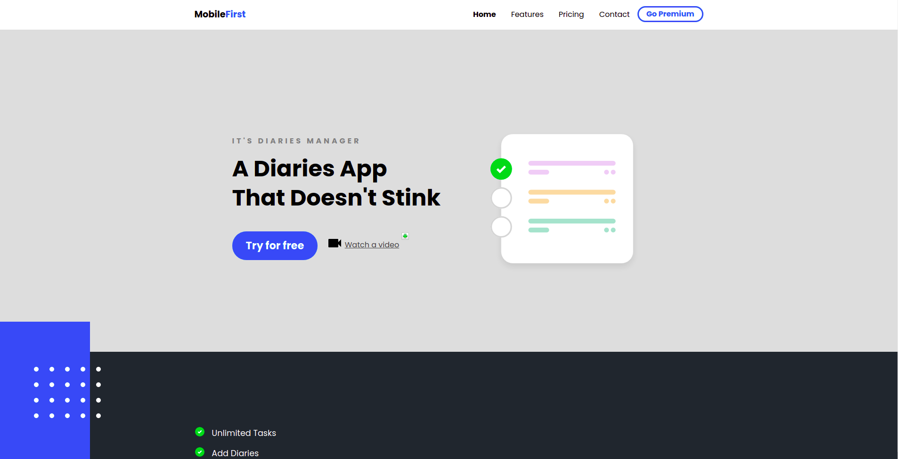
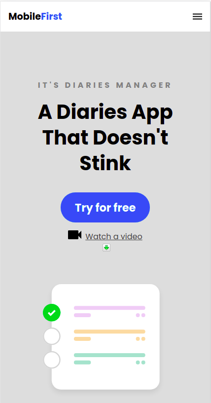

# Mobile-First-Landing
This is a Fully Responsive, Mobile-first Landing Page built using HTML, CSS, Scss, and little bit of JS

### Link :link: https://mobile-first-design.netlify.app/

## Interface

## Mobile Interface

## Run Locally

- Run this command `git clone https://github.com/developer-junaid/Mobile-First-Landing.git`
- You are now in the dev environment and you can play around

## Features

- Blogs 
- Categories
- Accessibility Optimized
- Mobile Responsive
- Open Source (Tweak it and use it) :)

## Tech Stack

- HTML5
- CSS3
- Scss
- ES+6
- Netlify
